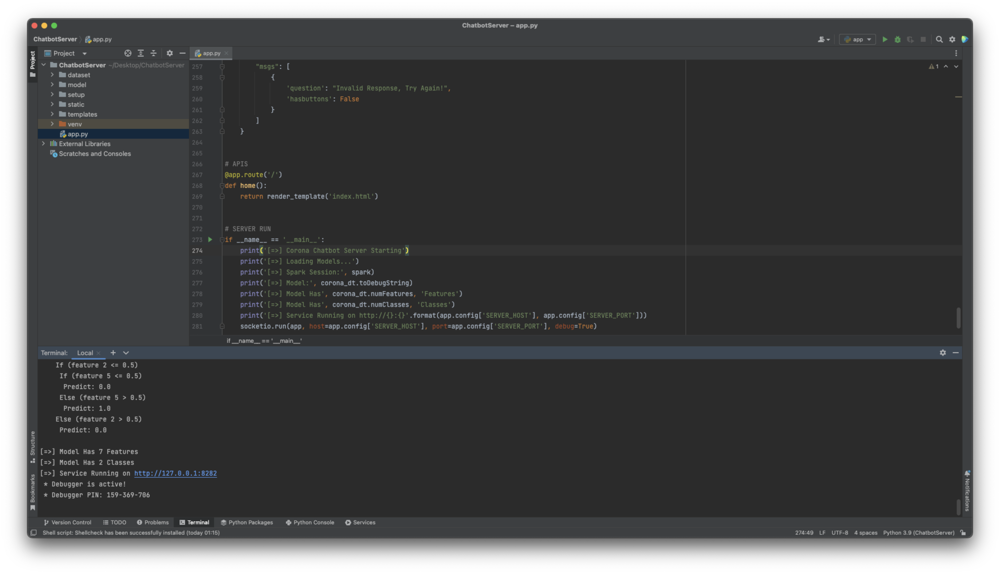
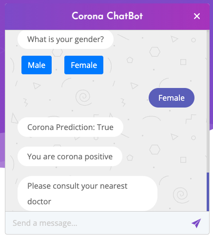

## Corona Symptoms Detection Chatbot
DATA-228 Big Data Project to implement a chat to predict covid-19 symptoms using pretrained model.

## Tech Stack
- PySpark (With OpenJDK 11 and Apache Spark 3.3)
- Socket.io
- Pandas
- Flask
 
## Gallery
- Project View

- Chatbot Portal

## Demo
https://user-images.githubusercontent.com/11852869/175812445-426d6882-10d7-4dd3-a0e8-3f240ddb5563.mp4
	
## How to start
- Setup virtualenv if you want
- Install requirements.txt or Follow setup.sh
- Run `python app.py`

## Technlogy Communication
> Email: patel.kuldip91@gmail.com
